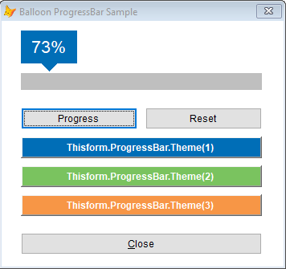
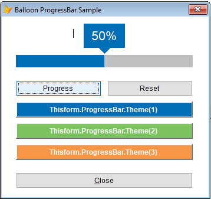
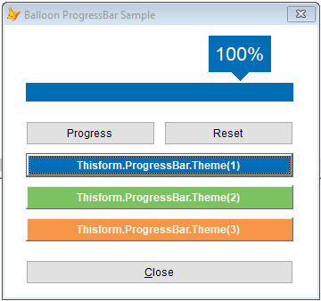
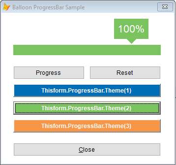
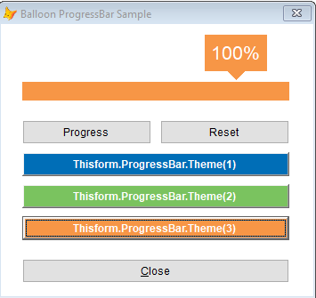

# BalloonProgressBar   

Another VFP progress bar yet good looking. It has a balloon tip!

<hr>

## Properties
*  **Theme:** Provide an integer from 1 to 3 to render corresponding Style (blue, green, orange).

## Methods

*  **Update(tnRate As Integer):** update the progresss bar and balloon thermometer.
  * **tnRate:** represents an integer rate. Eg. 10%, 20%, 30%

*  **Reset():** resets the progresss bar and balloon thermometer.

## Basic Usage

```
Just Drag & Drop the BalloonProgressBar into your Form.
```

## Images

 **Sample Screen**
 **Updating the progress bar**
 **Blue Theme**
 **Green Theme**
 **Orange Theme**

## License

BalloonProgressBar is released under the MIT Licence.
